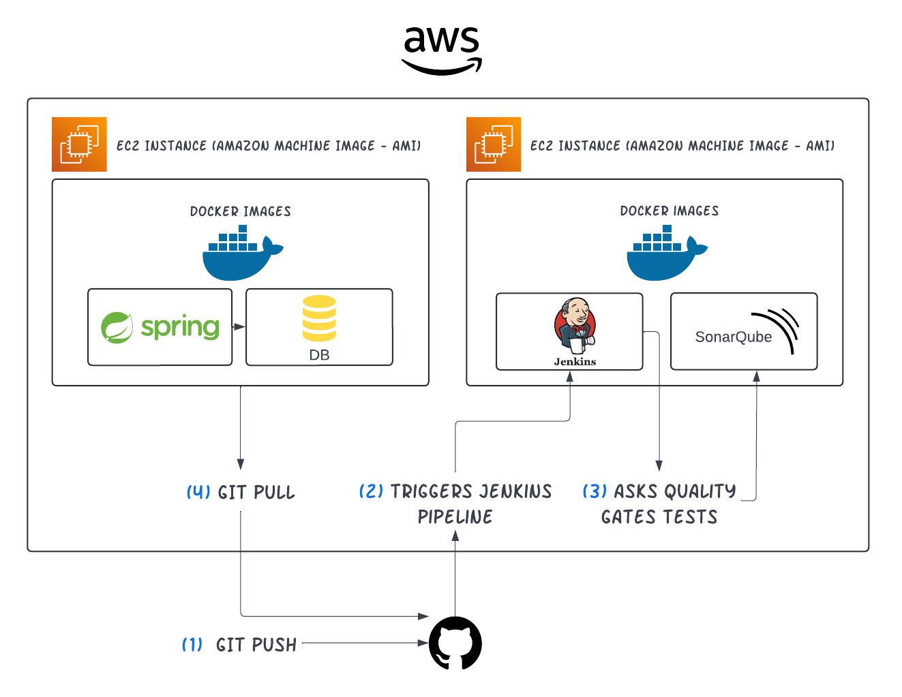

# Java and Postgres with CI/CD starter structure | Dockerized

---

**The project provides a initial structure with docker-compose containing java and postgres images, with ready integration with the database. Also, it will give you a starter CI/CD structure with Jenkins and SonarQube.** 



Volumes and Maven build configurations have already been defined. You can start from a generic CRUD to scale the application, having the initial configuration 100% functional.

> 🔵 No ORM framework was implemented, it implements native JDBC, since the goal is to provide a generic starting structure on which you can scale the application. You can implement any other tool.
> 

> 🔵 It uses Spring Boot to create the Rest endoints instead of a JAX-RS implementation, in order to remove the serverlets configuration work.
> 

## CI/CD

There are also docker-compose files for uploading jenkins and sonarQube instances. Follow the instructions to integrate the two tools into your project.

The Jenkinsfile pipeline has three basic stages: Compile and Build, Sonar Static Analysis and Tests.

> 🚩 The next update will a CD pipeline, allocating the artifacts in an artifactory and providing easy deployment.
> 

**Tools**:

- Docker
- Spring Boot
- PostgreSQL
- Jenkins
- SonarQube
- Everything was hosted on AWS EC2

## How to run Application:

1. Build the compose file for the first time
    
    ```powershell
    docker-compose up
    ```
    
2. After changing source code, rebuild backend image to see the changes.
    
    ```powershell
    docker-compose build backend
    ```
    
3. Repeat first step, so the database container status will be kept as Running, while the backend container will be recreated.

## Running Jenkins and SonarQube

  Up the compose files 

```powershell
docker-compose -f compose-jenkins.yaml up -d
docker-compose -f compose-sonar.yaml up -d
```

Access Jenkins and Sonar on ports 8003 and 9000 respectively.

## Setting up Integration between Git, Jenkins and SonarQube

- Create a webhook on your repository and point it to *[machine-ip]:8003/github-webhook*
- Create a GithubApp and provide it's credentials on Sonar Dashboard, so Sonar can access your repository. More info [here](https://docs.sonarsource.com/sonarqube/latest/devops-platform-integration/github-integration/setting-up-at-global-level/setting-up-github-app/).
- On Jenkins, go to Manage Jenkins > System and install a Sonar Cube Server named “Sonar Qube Server”. **Obs**: you must have installed Sonar Cube Plugin for Jenkins before it.
- On Sonar webhooks, create a new one with the address  *[machine-ip]:8003/sonarqube-webhook/*